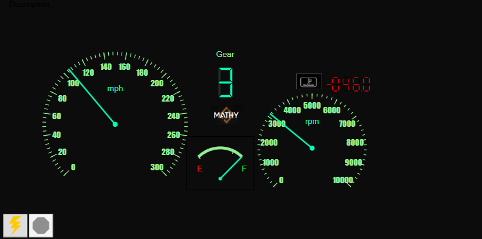

# CANoe Virtual Dashboard Panel – Automotive Simulation

This project showcases a **custom automotive dashboard** built using **Vector CANoe /pro DE** panel designer, intended for simulation and testing of in-vehicle networks and diagnostics.

## 🚗 Dashboard Overview

The panel simulates a real-time vehicle cluster with the following components:

- **Speedometer** (mph)
- **Tachometer** (RPM)
- **Gear Indicator** (0–6)
- **Fuel Gauge** (E to F)
- **Engine Warning Icon**
- **Driver Tag Display** (`MATHY` branding)

### 📸 Panel Screenshot


## 📶 Signals Simulated

The panel is connected to a simulated CAN configuration (`.cfg`) and reads the following signals:

| Signal Name        | Description                   | Range / Unit    |
|--------------------|-------------------------------|-----------------|
| `VehicleSpeed`     | Speed in miles per hour       | 0–300 mph       |
| `EngineRPM`        | Engine rotation speed         | 0–10,000 rpm    |
| `GearPosition`     | Current gear of transmission  | 0–6             |
| `FuelLevel`        | Fuel level from sensor        | 0–100 %         |
| `EngineWarning`    | Engine system alert           | On / Off        |

*(Screenshots of the signal graph and trace windows are included below.)*

## 📊 Signal Graph Snapshots

Include signal trends showing:
- Gear change transitions
- Speed and RPM ramp-up
- Fuel drain simulation

## ⚙️ Technologies Used

- Vector **CANoe /pro DE**
- **Panel Designer** with custom indicators
- **CAPL** scripting for signal logic (if used)
- Diagnostic Console (optional)

## 📁 Folder Structure

```
CANoeDashboard/
├── PanelConfig.cfg        # CANoe configuration file
├── README.md              # Documentation
├── dashboard_screenshot.png
├── signal_graph.png
└── signal_list.png
```

## 💡 Key Learning

- Design and integration of real-time vehicle dashboards
- Signal-to-panel data mapping
- UI layout and indicator behavior logic in CANoe
- Visualization for testing embedded ECUs
